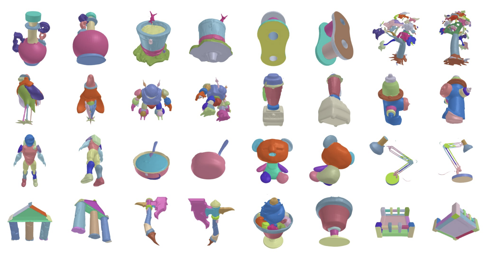
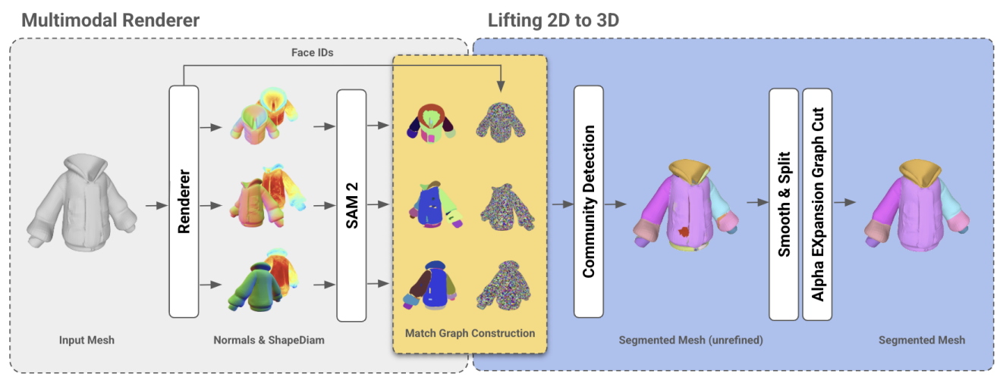
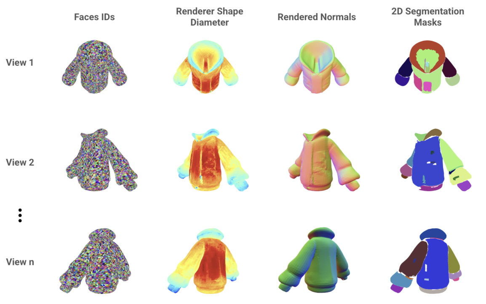

# Segment Any Mesh

[Segment Any Mesh](https://arxiv.org/abs/2408.13679) (SAMesh) is a novel zero-shot method for mesh part segmentation that addresses the limitations of traditional shape analysis (e.g. Shape Diameter Function (ShapeDiam)) and learning-based approaches. It operates in two phases: multimodal rendering, where multiview renders of a mesh are processed through Segment Anything 2 (SAM2) to generate 2D masks, and 2D-to-3D lifting, where these masks are combined to produce a detailed 3D segmentation. Compared to other 2D-to-3D lifting methods, SAMesh does not require an input vocabulary, which limits those methods to semantic segmentation as opposed to part segmentation. SAMesh demonstrates good performance on traditional benchmarks and superior generalization on a newly curated dataset of diverse meshes, which we release below.

Examples of running SAMesh on our curated dataset:


Pipeline of SAMesh:


Samesh handles untextured meshes, and it does so by rendering different modalities before applying Segment Anything (`mode` parameter in config).



## Installation

To install SAMesh, use the following commands:

```bash
pip install -e .
```

Don't forget to init the submodules and pip install -e on them respectively. We tested SAMesh on python 3.12 and cuda 11.8. If you encounter issues with building SAM2, try with the `--no-build-isolation` flag. If you pyrenderer issues related to ctypes, try installing `PyOpenGL==3.1.7`.


## Getting Started

Download a SAM2 checkpoint as provided in the SAM2 repo. `notebooks/mesh_samesh.ipynb` and `notebooks/mesh_shape_diameter_function.ipynb` are detail how to setup and run SAMesh and ShapeDiam, respectively. Some mesh examples from the curated dataset are provided in `assets`.


## Dataset

[Download link](https://drive.google.com/file/d/1qzxZZ-RUShNgUKXBPnpI1-Mlr8MkWekN/view?usp=sharing)


## Parameter Tuning
`configs/` contains the settings used for our dataset, CoSeg, as well as Princeton Mesh Segmentation Benchmark for Segment Any Mesh and Shape Diameter Function. Other datasets may need different parameters/settings. For example, PartNet works best with mode `matte` since many meshes are low poly, resulting in subpar normal and shape diameter function scalar renderings. In addition, for certain meshes where some faces are large e.g. PartNet, you should add a parameter `connections_threshold=0` under sam_mesh in the config, which controls how the minimum number of faces need to be covered by two regions for them to be considered mergable. Finally, you can disable the cache directory by commenting out the cache entry in the config, as the cache takes disk space.


## Contributors
George Tang*, William Zhao, Logan Ford, David Benhaim, Paul Zhang

*Work done during an internship at Backflip AI.
